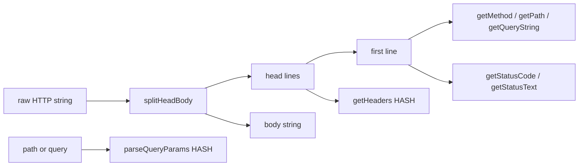

# Extend AdHTTPParser HTTP utilities

## Context

[`bootstrap/net_utils.ad`](bootstrap/net_utils.ad) already has URL helpers used by [`bootstrap/requests.ad`](bootstrap/requests.ad) (`removeProtocol`, `getDomain`, `getUri`, `mapToQueryParams`, …). `getBody()` / `getHeaders()` are empty stubs.

Servers (e.g. [`examples/test175.ad`](examples/test175.ad), [`bootstrap/sock.ad`](bootstrap/sock.ad)) get a **raw HTTP string** from `client.readHTTP()`. Important runtime detail from [`socket_utils.cpp`](socket_utils.cpp): `readHTTP` **normalizes `\r\n` → `\n`** and stops once headers end (`\r\n\r\n`), so parsers must treat `\n\n` as the head/body split, and body may be partial for large POSTs.

Available string ops live in [`bootstrap/string_utils.ad`](bootstrap/string_utils.ad): `split`, `splitFirst`, `indexOf`, `substring`, `startsWith`, `endsWith`, `replace`.

## Recommended utilities (concrete API)

Keep the existing URL helpers. Implement parsing methods that take a raw HTTP message (or a path/query fragment) and return hashes/strings — matching the style of `getUri` / `mapToQueryParams`.

### Core (implement these)

| Method | Role |
|--------|------|
| `splitHeadBody(raw)` | Split on first blank line (`\n\n` or `\r\n\r\n`); return `[head, body]` |
| `getHeaders(raw)` | Parse header block into a `HASH` (`"Content-Type"` → `"application/json"`). Skip request/status line. |
| `getBody(raw)` | Text after the blank line (replace the stub) |
| `getMethod(raw)` | First token of request line (`GET`, `POST`, …) |
| `getPath(raw)` | Path from request line, **without** query string |
| `getQueryString(raw)` | Query part after `?` (no leading `?`), or `""` |
| `parseQueryParams(source)` | Inverse of `mapToQueryParams`: `"a=1&b=2"` or `"/path?a=1"` → `HASH` |
| `getHeader(headers, name)` | Case-insensitive lookup in a headers hash |
| `getStatusCode(raw)` | Response status code as string/int from `HTTP/1.x 200 OK` |
| `getStatusText(raw)` | Reason phrase (`OK`, `Not Found`, …) |

### Small URL follow-ups (same file, high value for `requests.ad`)

| Method | Role |
|--------|------|
| `getPort(path_without_protocol, default_port)` | Host may be `host:8080`; today `getDomain` keeps the port in the hostname |
| `getHost(path_without_protocol)` | Domain **without** port (fix `getDomain` to call this, or leave `getDomain` and add `getHost`) |

Default: add `getHost` / `getPort`; leave `getDomain` behavior unchanged so existing tests don’t break, and document that servers/clients that need a clean host should use `getHost`.

### Explicitly out of scope (for later)

- Chunked transfer decoding, multipart forms, URL percent-decoding, full request builders / `buildResponse` — useful later, not needed for the first useful cut or for `test298`.

## Implementation approach

All logic stays in Ad in [`bootstrap/net_utils.ad`](bootstrap/net_utils.ad) (already loaded via [`bootstrap.cpp`](bootstrap.cpp)). No C++ / VM changes.

**Parsing details:**

1. `splitHeadBody`: prefer `indexOf(raw, "\r\n\r\n")`, else `indexOf(raw, "\n\n")` (covers `readHTTP` output).
2. Split head on `\n`; strip trailing `\r` from each line if present.
3. Request line: `split` on spaces → method, target, version. Split target on `?` for path vs query.
4. Headers: each `Name: value` via `splitFirst(line, ": ")` or `":"` then trim leading space on value; skip empty lines.
5. `getHeader`: iterate `__keys(headers)` and compare lowercased names (simple char walk or reuse existing string helpers — keep it small).
6. Response line: `tokens[1]` = status code, join rest as status text.

Bump `version` to `"0.2"`.

## Test: [`examples/test298.ad`](examples/test298.ad)

Offline unit-style script (like [`test286.ad`](examples/test286.ad) / [`test287.ad`](examples/test287.ad)) — **no sockets**. Sample fixtures:

1. **GET request** with query:  
   `GET /api/login?user=a&role=admin HTTP/1.1\nHost: localhost\nAccept: */*\n\n`
2. **POST request** with body:  
   headers + `\n\n{"username":"xyz"}`
3. **HTTP response**:  
   `HTTP/1.1 200 OK\nContent-Type: text/html\nContent-Length: 5\n\nhello`

Assert via `println` (and simple equality checks printed as `true`/`false`):

- method, path, query string, `parseQueryParams`
- headers hash + `getHeader(..., "content-type")` case-insensitive
- body
- status code / status text for the response sample
- optionally `getHost("example.com:8080/path")` / `getPort(..., 80)`

## Optional follow-up (not required for this change)

Wire `MultiThreadedEchoServer.process` / `AsyncSimpleResponseServer` to log `getMethod` + `getPath` instead of the full raw dump — only if you want a live demo; `test298` alone validates the parser.