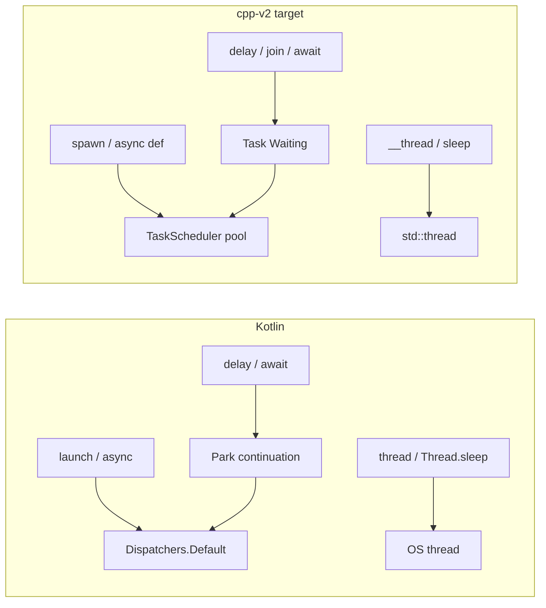
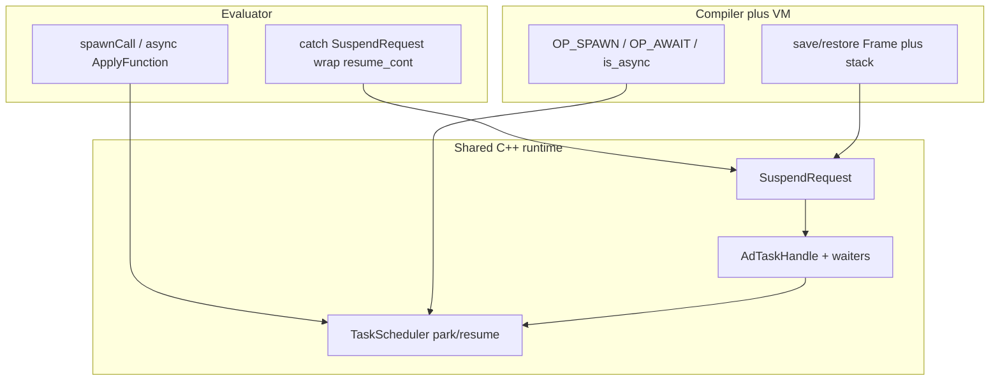

# Kotlin-style M:N threading for cpp-v2

## Goal

Make cpp-v2 concurrency resemble **Kotlin coroutines**, matching the model already proven in lang4 ([park-delay-virtual-threads.plan.md](/Users/adrianpoplesanu/Documents/git-projects/personal-work/cursor-generated/lang4/.cursor/plans/park-delay-virtual-threads.plan.md)):

- Every Ad-level wait (`delay`, `join`, `await`) is a **suspend point**.
- Suspend **parks the task** and **frees the worker** (carrier). Pool threads never call `sleep_for` or `future.get` while running Ad tasks.
- Resume when the event fires: **timer** for `delay`, **child completion** for `join`/`await`.
- Nested `spawn` stays on the shared M:N pool (no overflow pthread as the normal path).
- Top-level / REPL may still block (Kotlin `runBlocking` analogue).
- Success metric (same as lang4): **100k concurrent `delay(1000)` then join all ≈ 1–2s wall clock**, not ~100k seconds. lang4 measured **~1.8s**.

cpp-v2 already has the *surface* of this API in the evaluator (`spawn`, `async def`, `await`, `join`, `task_*`) and a `TaskScheduler` thread pool. What it does **not** have is park/resume. That is the entire lang4 delta, plus VM parity (lang4 has no VM).

## Kotlin mental model (what we are copying)



Kotlin mapping we will match (lang4 semantics, not a full kotlinx.coroutines library):

- `launch { }` → `spawn(fn, args...)` (handle also carries a result, so it is closer to `async`+`Deferred`)
- `async { }` / `Deferred` → `async def` call, or `spawn`; both return `OBJ_TASK`
- `await` / `Deferred.await()` → `await expr` and `join(t)` (same park path)
- `delay(ms)` → `delay(ms)` (park + timer; resume `null`)
- `Dispatchers.Default` workers → `TaskScheduler` (N pthreads, `hardware_concurrency`, min 2, 8MB stacks)
- `runBlocking` → main/REPL blocking `join`/`delay`
- `Job.cancel()` → `task_cancel(t)` (cooperative)
- `thread { }` / `Thread.sleep` → existing `__thread` + `sleep` (keep; do not park arbitrary C++ blocking)

Explicit non-goals (same as lang4):

- No `Mutex` / `Channel` / `select` / `actor` / `Flow`
- No `Dispatchers.IO` / `Main` / `withContext`
- No structured concurrency (`coroutineScope`, cancel-children)
- No parking of raw socket/`mutex`/`future` C++ waits — Kotlin also does not magically park `Thread.sleep`
- No Java Loom virtual-thread semantics (parking arbitrary native blocking)

---

## Part 1 — lang4 threading model (source of truth)

lang4 is a **tree-walking interpreter only**. Concurrency lives in C++: evaluator + `TaskScheduler` + builtins. There is no VM and no `bootstrap/`.

Key files:

- [`src/scheduler.h`](/Users/adrianpoplesanu/Documents/git-projects/personal-work/cursor-generated/lang4/src/scheduler.h) / [`scheduler.cpp`](/Users/adrianpoplesanu/Documents/git-projects/personal-work/cursor-generated/lang4/src/scheduler.cpp)
- [`src/evaluator.cpp`](/Users/adrianpoplesanu/Documents/git-projects/personal-work/cursor-generated/lang4/src/evaluator.cpp)
- [`src/builtins.cpp`](/Users/adrianpoplesanu/Documents/git-projects/personal-work/cursor-generated/lang4/src/builtins.cpp) (`builtin_delay`, `joinTaskValue`)
- [`src/object.h`](/Users/adrianpoplesanu/Documents/git-projects/personal-work/cursor-generated/lang4/src/object.h) (`TaskObject`, `TaskStatus::Waiting`)

### Architecture

```
.ad program
  → Evaluator (tree walk)
       spawn / async fn call  → TaskScheduler.submitPreemptible
       delay / join / await in a task → throw SuspendRequest → park
       delay / join / await on main   → sleep_for / future.get
  → TaskScheduler
       N worker pthreads + 1 timer pthread
       FIFO runnable queue
       delay min-heap {wake_at, generation, task}
       per-task waiter lists for join/await
```

### Suspend control transfer

`SuspendRequest` is not a `std::exception`; it is thrown as a control-flow object with:

- `Kind::Delay` + `wake_at`, or `Kind::Join` + `join_target`
- `resume_cont: Value → Value` (inject resume value, continue remaining computation)
- `done_after` for `return` that suspended

`RunSliceResult` has three statuses: `Completed`, `Yielded` (quantum), **`Suspended`**.

Worker loop:

- `Completed` → `finishTask` (set result, wake join waiters)
- `Yielded` → requeue immediately
- `Suspended` → `armResumeSlice`, then `parkOnDelay` or `parkOnJoin` (never sleep)

### Park vs block (the Kotlin rule)

[`builtin_delay`](/Users/adrianpoplesanu/Documents/git-projects/personal-work/cursor-generated/lang4/src/builtins.cpp) (lines 156–175):

- If `inTaskExecutionContext()`: throw `SuspendRequest{Delay}` — **do not sleep**
- Else (main/REPL): `this_thread::sleep_for`

[`joinTaskValue`](/Users/adrianpoplesanu/Documents/git-projects/personal-work/cursor-generated/lang4/src/builtins.cpp) (lines 179–224):

- If already has result: return / rethrow
- If in task context: throw `SuspendRequest{Join}`
- Else: `future.get()` (blocking bridge)

`await` uses the same join path.

### Nested spawn

lang4 `submitPreemptible` **always enqueues** on the shared pool, including from worker threads. Overflow pthreads were removed as the normal path because park-on-join frees the carrier (no deadlock from “worker blocked in `join` of a child that needs a worker”).

### Continuations in the evaluator

Because lang4 has no bytecode frames, resume is rebuilt as C++ lambdas that recapture AST pointers + `Environment`. `evalBlockStatement` wraps ~2 nested `catch (SuspendRequest)` layers. Incomplete wrapping for `for`/`if`/array literals is a known lang4 limitation; tests stay in simple positions.

### Preemption is incomplete (do not cargo-cult this as “done”)

lang4 `checkpoint()` on budget exhaustion calls `std::this_thread::yield()` and **continues the same `work()` to completion**. Fairness tests pass because there are **multiple workers**, not because of time-slicing. cpp-v2’s evaluator already has this same fake yield in [`ad_task_checkpoint`](task_scheduler.cpp) / [`runWorkSlice`](evaluator.cpp). Matching lang4 means park/resume is required; true slice preemption is optional (and the VM can do it better — see below).

### lang4 evaluation / tests

Benchmark: [`tests/spawn_100k_sleep.ad`](/Users/adrianpoplesanu/Documents/git-projects/personal-work/cursor-generated/lang4/tests/spawn_100k_sleep.ad) — 100k `spawn` of `delay(1000)`, then `join` each; uses mutating `append` so the bench is parking, not O(n²) array copies. Target **1–2s**; notes.md records **~1.8s**.

Functional tests to port (all under lang4 `tests/`):

- `async_await.ad` — `async fn`, `await`, `spawn`+`join`
- `parallel_delay_basic.ad`, `staggered`, `many_tasks`, `join_order`
- `parallel_delay_nested_spawn.ad` — **the park-on-join correctness test** (`join` of children inside a parent task)
- `parallel_delay_async_await.ad`, `spawn_async_mix`
- `parallel_delay_cancelled.ad`, `cancel_many`
- `parallel_delay_status_metrics.ad`, `fairness_with_sleepers`
- `preemption_cancel.ad`, `preemption_metrics.ad`, `preemption_fairness.ad`
- `parallel_threads.ad` / `sequential_fib.ad` — CPU parallel vs sequential
- `spawn_100k.ad` — spawn/join throughput without delay

---

## Part 2 — cpp-v2 current state (what already exists)

cpp-v2 has **two concurrency layers**. They are not equivalent and must stay distinct, as in Kotlin (`coroutine` vs `Thread`).

### Layer A — OS workers (`__thread`) — keep as-is

Works on **both evaluator and VM**. This is the production pattern today.

API:

- `th = __thread("label")`
- `th.callback(fn, args...)` (alias `execute`)
- `th.runAsync()` (alias `start`) — `std::thread`, fire-and-forget
- `th.runBlocking()` (alias `join` on the **thread object**)
- `result = th.await()` — join the OS thread, return `.result`

Implementation: [`thread_utils.cpp`](thread_utils.cpp), [`thread_workers.cpp`](thread_workers.cpp). VM path: `OP_GET_METHOD` on `OBJ_THREAD` → `call_runtime_bound_method` ([`vm/vm.cpp`](vm/vm.cpp) ~1144). Workers for closures create a **new VM** sharing parent `constants`/`globals`.

**Bootstrap** ([`bootstrap/sock.ad`](bootstrap/sock.ad) `MultiThreadedEchoServer.start`): accept loop on main, `__thread` + `callback(this.process, client)` + `runAsync()`. `net_utils.ad` / `requests.ad` are synchronous; parallelism is the caller’s job.

**Examples that already run threading** (all `__thread`, not `spawn`):

- Servers: [`examples/test300.ad`](examples/test300.ad) (`ApplicationServer` on 5005), [`test175.ad`](examples/test175.ad), [`test177.ad`](examples/test177.ad), [`test197.ad`](examples/test197.ad)–[`test199.ad`](examples/test199.ad); bootstrap launcher [`test297.ad2`](examples/test297.ad2)
- Parallel clients: [`examples/test301.ad`](examples/test301.ad) (6 `__thread` HTTP clients + `await`, asserts all 200)
- Basics: `test143`–`test148`, `test169`, `test181`–`test190`, `test207`–`test213`
- `sleep` inside OS workers: `test186`, `test177`, `test207`, etc. — **must keep blocking** (`Thread.sleep` analogue)

These already run under `./main -vm`. Do **not** rewrite them onto `spawn` in this work: `readHTTP` / `sendAndReadBackHTTP` are blocking C++ I/O, and lang4 explicitly does not park arbitrary native blocking. A spawn-based server without IO parking would pin every pool worker on `accept`/`read`.

### Layer B — tasks (`spawn` / `async def` / `await`) — evaluator only, and it still blocks

Parser already has `ST_SPAWN_EXPRESSION`, `ST_AWAIT_EXPRESSION`, `async def` ([`parser.cpp`](parser.cpp), [`ast.h`](ast.h)). Evaluator implements them ([`evaluator.cpp`](evaluator.cpp) ~108–144, `spawnCall` ~2461, `ApplyFunction` async wrap ~665).

Builtins already exist: `join`, `delay` (**alias of `sleep`**), `task_status`, `task_cancel`, `task_metrics` ([`builtins.cpp`](builtins.cpp)).

Only spawn examples today: [`examples/test_spawn_async.ad`](examples/test_spawn_async.ad) and [`examples/test293.ad2`](examples/test293.ad2) — trivial CPU `spawn`+`join` / `async def`+`await`, no `delay`, no nested join.

[`TaskScheduler`](task_scheduler.h) is an **earlier lang4 snapshot**:

- Has: worker pool, FIFO queue, `submitPreemptible`, quantum 20000, `Yielded` requeue, `ad_task_checkpoint`, `joined` single-shot flag, metrics, overflow pthread when `tls_in_worker_`
- **Missing vs lang4:** `TaskStatus::Waiting`, `RunSliceResult::Suspended`, timer thread, delay heap + generation, waiter lists, `parkOnDelay`/`parkOnJoin`, `armResumeSlice`, `requestCancel` of parked tasks, `result_value` on the handle (join always `future.get()`)

Consequence: `delay`/`sleep` in a task still `sleep_for` in 50ms slices ([`sleep_builtin`](builtins.cpp) ~507). `join`/`await` always `future.get()` ([`ad_task_join_handle`](task_scheduler.cpp) ~68). Nested `spawn` from a worker starts an **overflow pthread** ([`submitPreemptible`](task_scheduler.cpp) ~245). 100k `delay(1000)` would take ~1000s of worker-time, not ~1s of wall clock.

Compiler/VM ([`docs/vm-parity-matrix.md`](docs/vm-parity-matrix.md) Phase 7):

- `compile()` has **no** `ST_SPAWN_EXPRESSION` / `ST_AWAIT_EXPRESSION` cases — silent no-op after the last `else if` ([`vm/compiler.cpp`](vm/compiler.cpp) ~946)
- `AdCompiledFunction` has **no** `is_async` ([`vm/objects.h`](vm/objects.h))
- No `OP_SPAWN` / `OP_AWAIT`
- `join`/`task_*` builtins are callable but never receive an `OBJ_TASK` from the VM
- `Repl` still constructs `TaskScheduler` in VM mode ([`repl.cpp`](repl.cpp) ~34) but the VM never submits to it

### Shared-state / GC hazards already present

- Evaluator spawn uses a **local `GarbageCollector` per slice**; result is `copy()`’d into the parent GC on join. Parking must **keep that heap alive across suspend**, or results and captured objects die.
- `Environment` has a recursive mutex; instance fields / lists are unsynchronized (see `test190.ad` race demo). Same as lang4; do not expand into a Mutex API in this work.
- `spawn()` currently requires `OBJ_FUNCTION` only. VM will need `OBJ_CLOSURE` / `OBJ_BOUND_METHOD`. Evaluator should also accept bound methods (lang4 does: `spawn(dog.inc)`).

---

## Part 3 — Evaluation of the change (why, cost, success)

This is the same evaluation lang4 used: prove carriers are not blocked, then prove existing programs still work.

### What improves

- **100k concurrent delays become possible.** Today each `delay(1000)` occupies a pool worker (or overflow thread). After park, 100k tasks sit in the delay heap and ~N workers stay free. Wall clock ≈ max(delay) + spawn/join overhead ≈ **1–2s**.
- **Nested `spawn`+`join` does not deadlock/starve.** Today a worker that `join`s a child either blocks (`future.get`) or the child runs on an overflow OS thread. After park-on-join, parent frees the carrier; child runs on the same pool. This is the Kotlin `async`/`await` inside `launch` story.
- **VM gains the documented Phase 7 gap** (`spawn`/`await` parity). lang4 never had this; cpp-v2 can go further by saving real bytecode frames instead of AST lambdas.
- **`delay` vs `sleep` become Kotlin-accurate.** Today they are the same builtin. After the change: `delay` parks in task context; `sleep` always blocks (OS-thread / main). Existing `__thread` tests that call `sleep` keep working.

### What does not change (and must not regress)

- `__thread` servers (`test300`, `sock.ad` `MultiThreadedEchoServer`) stay 1:1 OS threads. Blocking `readHTTP` is still a carrier pin — on an OS thread, which is correct.
- `test301` parallel clients stay `__thread`+`await` (thread-object await, not task await).
- No new language syntax beyond what the parser already has.
- No Mutex/Channel. Shared mutation remains racy (`test190.ad`).

### Risks / cost

- **Evaluator continuations** are the hardest evaluator piece. lang4 only nested two block-resume layers; cpp-v2’s `Eval()` is a large switch and must catch `SuspendRequest` at statement/expression positions used by tests (`let` RHS, `return`, remaining block statements, infix, call args). Do not attempt full CPS of every AST node in v1 — match lang4’s “tests used in current suite” coverage.
- **VM frame snapshots** are the hardest VM piece, but conceptually cleaner: save `frames` + stack `[0, sp)` + `sp` + `frames_index`, restore on resume, inject resume value as the result of `delay`/`join`/`await`.
- **GC lifetime:** one heap per **task**, not per slice. Parked VM frames hold pointers into that heap. Parent join must still `copy()` into the caller GC.
- **`delay`/`sleep` split** is a behavior change for anyone who called `delay` expecting `sleep_for` inside a task. There are **no** such examples today (`delay` is unused in `examples/`). Low regression risk.
- **Single-shot join** stays as in lang4 (`joined.exchange(true)`). Document it; do not “fix” to Kotlin multi-await in this work.
- Fake CPU preemption stays fake in the evaluator. Optionally make it real in the VM once snapshots exist.

### Success criteria (copy lang4, plus VM)

1. Workers never `sleep_for` / `future.get` while `ad_tls_task_ctx()` is set.
2. `examples/spawn_100k_sleep.ad` (new, port of lang4): 100k × `delay(1000)` + join ≈ **1–2s** on both `./main` and `./main -vm`.
3. Nested spawn+join test prints `11` (5+6) without overflow threads.
4. Ported `parallel_delay_*` / `async_await` tests pass on evaluator **and** VM (parity L2/L3 for async).
5. Existing `__thread` examples (`test186`, `test300`/`test301` pattern, `test_spawn_async.ad`) still pass.
6. `task_cancel` of a parked delay fails the waiter with `"task cancelled"` (lang4 `parallel_delay_cancelled.ad`).
7. `docs/vm-parity-matrix.md` Spawn/await row: Compiler Y, VM Y.

---

## Part 4 — Implementation (shared scheduler, then evaluator, then VM)

Work in this order. The scheduler is shared; evaluator and VM are two front-ends onto it.



### 4.1 Shared scheduler — port lang4 into [`task_scheduler.h`](task_scheduler.h) / [`task_scheduler.cpp`](task_scheduler.cpp)

Port types almost verbatim (Ad-prefixed):

- Add `AdTaskStatus::Waiting`.
- Extend `AdRunSliceResult` with `Suspended`, `resume_continuation`, `suspend_kind`, `wake_at`, `join_target`.
- Extend `AdScheduledTask` with `pending_resume`, `pending_error`, `has_pending_resume`.
- Extend `AdTaskHandle` with `mu`, `waiters`, `result_value` / `result_error` / `has_result`, `weak_ptr<TaskScheduler> scheduler`, `parked_scheduled`, `delay_generation`.
- Add `SuspendRequest` (Delay/Join, resume_cont, done_after) in the scheduler header so builtins/evaluator/VM can throw the same type.
- Timer pthread + delay min-heap + generation invalidation (copy lang4 `timerLoop` / `parkOnDelay`).
- `parkOnJoin` / waiter wakeup from `finishTask` / `failTask` (copy lang4).
- `armResumeSlice` + `runResumeSlice` entry that re-enters evaluator **or** VM with the pending value.
- `requestCancel`: set flag, fail parked task immediately (generation bump for delay).
- **Always enqueue** in `submitPreemptible` (delete the `tls_in_worker_` overflow-pthread normal path). Keep overflow only if `scheduler == nullptr` (legacy `spawnCall` fallback).
- `ad_task_join_handle`: if `ad_tls_task_ctx()` set → throw `SuspendRequest{Join}`; else `future.get()`. Also short-circuit on `has_result`.
- Split sleep: new `delay_builtin` that parks; keep `sleep_builtin` blocking (50ms checkpoint slices can remain for cancel of **sleep**, but `delay` must not sleep).

Worker loop addition (lang4 [`scheduler.cpp`](/Users/adrianpoplesanu/Documents/git-projects/personal-work/cursor-generated/lang4/src/scheduler.cpp) ~378–388): on `Suspended`, arm resume then park; never `sleep_for`.

`task_cancel_builtin` must call `scheduler->requestCancel(handle)`, not only store the flag (parked delay would otherwise sit until the timer fires).

### 4.2 Evaluator — suspend wrapping in [`evaluator.cpp`](evaluator.cpp)

Follow lang4’s `evalBlockStatement` pattern, adapted to cpp-v2’s `Eval` switch:

- Introduce catching of `SuspendRequest` in:
  - block remaining statements
  - `let` RHS
  - `return` expression (`done_after = true`)
  - infix left/right
  - call arguments
- Minimum viable = positions used by ported tests (`let t = spawn(...)`, `return join(c1) + join(c2)`, `println(await t2)`, `delay` as a statement).
- `runWorkSlice`: catch `SuspendRequest` and return `AdRunSliceResult{Suspended, resume_cont, kind, wake_at, join_target}` instead of only Completed/Yielded.
- **Per-task GC:** move `GarbageCollector local_gc` + inner `Evaluator` out of the slice lambda and onto state owned by the `AdScheduledTask` / a `TaskEvalState` shared_ptr captured by `run_slice` **and** `resume_continuation`, so park does not destroy the heap.
- `spawnCall`: accept `OBJ_FUNCTION` and bound methods; keep returning `Ad_Task_Object`.
- `ST_AWAIT_EXPRESSION`: route through `ad_task_join_handle` (park vs block decided there). Do not wrap await in its own special case beyond join.
- Async `ApplyFunction` / `ApplyMethod`: keep “call submits a new pool task and returns `OBJ_TASK` immediately” (lang4 / not Kotlin `suspend fun` on the caller). Keep `g_ad_apply_function_disable_async` so the worker runs the body inline.

Do not try to fix lang4’s fake CPU yield in the evaluator in this work.

### 4.3 Compiler — emit spawn/await/async in [`vm/compiler.cpp`](vm/compiler.cpp)

Add opcodes in [`vm/opcode.h`](vm/opcode.h), [`vm/code.cpp`](vm/code.cpp) (definitionsMap), [`vm/opcode.cpp`](vm/opcode.cpp) if needed:

- `OP_SPAWN` — operands: arity (1 byte), like `OP_CALL`. Stack: callee, args... → push `OBJ_TASK`.
- `OP_AWAIT` — 0 operands. Stack: task → result (or suspend).

Compile:

- `ST_SPAWN_EXPRESSION`: compile callee, compile args, `emit(OP_SPAWN, arity)` — same shape as `ST_CALL_EXPRESSION`.
- `ST_AWAIT_EXPRESSION`: compile operand, `emit(OP_AWAIT)`.
- `ST_FUNCTION_LITERAL` / `ST_DEF_STATEMENT` / class methods: copy `is_async` onto `AdCompiledFunction` (new field in [`vm/objects.h`](vm/objects.h)).

Do **not** compile `spawn` as a builtin call: it is already a keyword, and silent-drop is the current bug.

### 4.4 VM — park by saving frames, not by blocking, in [`vm/vm.cpp`](vm/vm.cpp) / [`vm/vm.h`](vm/vm.h)

This is the part lang4 never had. Use the same `TaskScheduler`, but represent the continuation as a **VM snapshot** instead of AST lambdas.

**Snapshot** (heap-allocated, owned by the scheduled task):

- copy of `frames` (each `Frame` is `cl`, `ip`, `base_pointer`, `bound_instance`)
- `stack[0..sp)` object pointers
- `sp`, `frames_index`
- pointer to the per-task `GarbageCollector`
- shared `constants` / `globals` / `global_names` / `bootstrap_global_names` (same sharing as `invoke_callable` / `__thread` workers)

**`OP_SPAWN`:** pop args+callee; require `OBJ_CLOSURE` or `OBJ_BOUND_METHOD`; `submitPreemptible` a slice that constructs (or restores) a worker VM, `execute_call`, `run()`. Push `Ad_Task_Object` on the **caller** VM.

**`OP_CALL` of `is_async` closure:** do not run inline; same as spawn of that closure with the current args; push task. Need a TLS/flag analogue of `g_ad_apply_function_disable_async` so the worker’s inner call runs the body.

**`OP_AWAIT` and `join`/`delay` builtins:** if in task context, throw `SuspendRequest`. `VM::run()` / `execute_instruction` must catch it, fill the snapshot, rewind the worker VM so the slice returns `Suspended`, then the scheduler parks.

**Resume:** restore snapshot into a worker VM, push resume value (`null` after delay; child result after join) as the value that `delay`/`join`/`OP_AWAIT` would have pushed, continue `run()`. If a further suspend happens, snapshot again.

**Quantum yield (VM-only improvement, recommended once snapshots exist):** at `ad_task_checkpoint()` budget exhaustion inside a VM task, throw a `SuspendRequest`-like Yield and requeue with the same snapshot. Unlike lang4, this would be **real** cooperative preemption. Keep it behind the same `ADLANG_QUANTUM_BUDGET`. If it threatens schedule, ship park first and add yield as a fast follow.

**`invoke_callable`:** keep for `__thread` workers (blocking OS threads). Do not route `__thread` through `TaskScheduler`.

GC: worker VM `gc` is the per-task collector. On `finishTask`, `ad_task_join_handle` continues to `result->copy(caller_gc)`.

### 4.5 REPL / process lifetime

[`repl.cpp`](repl.cpp) already creates one `TaskScheduler` per `Repl` and sets the global. Keep that for both evaluator and VM file runs.

Destructor already `reset()`s the scheduler (joins workers). After park, destructor must also **stop the timer thread** and fail or drain parked tasks (copy lang4 `~TaskScheduler` + `timerLoop` stop). Do not destroy the scheduler while 100k delay tasks are still waiting.

Optional: `ADLANG_QUANTUM_BUDGET` already wired; no change.

### 4.6 Tests to add (port lang4; run on both engines)

New files under [`examples/`](examples/) (or `tests/parity/fixtures/async/` for the differential runner):

- `spawn_100k_sleep.ad` — use `__append` (cpp-v2 mutating append) not `push`
- `parallel_delay_basic.ad`, `nested_spawn.ad`, `join_order.ad`, `async_await.ad`
- `parallel_delay_cancelled.ad`
- Keep [`test_spawn_async.ad`](examples/test_spawn_async.ad) as a smoke test

Parity: add fixtures to [`tests/parity/`](tests/parity/) so `run_parity.py` covers spawn/await/delay (deterministic short delays, e.g. 20–50ms, not 1000ms except the manual bench).

Manual eval command (lang4 style):

```
/usr/bin/time -p ./main examples/spawn_100k_sleep.ad
/usr/bin/time -p ./main -vm examples/spawn_100k_sleep.ad
```

Expect `real` ≈ 1.x–2 seconds, not hundreds.

Regression: do not break `__thread` tests; at least re-run `test_spawn_async.ad`, `test186.ad` (sleep on OS threads), and document that `test300`/`test301` remain the OS-thread HTTP pair.

### 4.7 Docs

Update [`docs/vm-parity-matrix.md`](docs/vm-parity-matrix.md) Spawn/await row and [`docs/vm-evaluator-parity-plan-short.md`](docs/vm-evaluator-parity-plan-short.md) Phase 7 when compiler+VM land.

---

## Part 5 — Bootstrap and existing thread tests (do not migrate)

[`bootstrap/sock.ad`](bootstrap/sock.ad) `MultiThreadedEchoServer` and [`examples/test300.ad`](examples/test300.ad) should **keep** `__thread`. Rationale:

- Handler work is blocking POSIX I/O (`readHTTP`, `send`).
- Kotlin would put that on `Dispatchers.IO` or use suspend sockets; we are not adding IO parking (lang4 non-goal).
- Putting 1000 blocking accepts on the M:N pool would starve `delay`/`join` tasks — the opposite of the Kotlin model.

A later, separate project could add `Dispatchers.IO`-like extra workers or parkable sockets. Out of scope.

`sleep` in `__thread` callbacks (`test186.ad`, `test177.ad`) stays `sleep_for`. Only `delay` inside `spawn`/`async def` parks.

---

## Implementation order (mirrors lang4 park plan, then VM)

1. **Suspend infra** in `task_scheduler.*`: Waiting, Suspended, waiter list, `SuspendRequest`.
2. **Park `delay`**: timer thread + resume `null`; split `delay` vs `sleep`.
3. **Park `join`/`await`**: waiter list; wake on finish/fail/cancel; main-thread blocking bridge.
4. **Nested spawn**: always enqueue; remove overflow path.
5. **Evaluator continuations + per-task GC**; port delay/nested tests on `./main`.
6. **100k sleep bench on evaluator** until ~1–2s.
7. **Compiler opcodes + `is_async`**; VM snapshot park/resume; same tests on `./main -vm`.
8. **Parity fixtures + matrix**; confirm `__thread` examples still work.

## Done when

- Pool workers never block on Ad waits.
- 100k concurrent delays ≈ 1s wall clock with joins, evaluator **and** VM.
- `join`/`await` inside tasks park like Kotlin `await`.
- Nested spawn+join needs no overflow threads.
- `__thread` bootstrap/servers unchanged and still VM-capable.
- Phase 7 spawn/await parity marked implemented.
