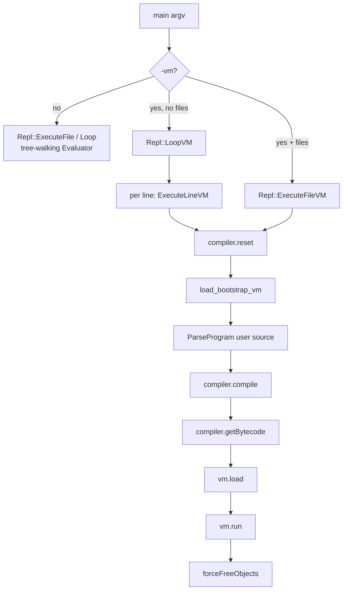
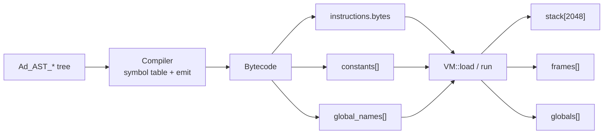
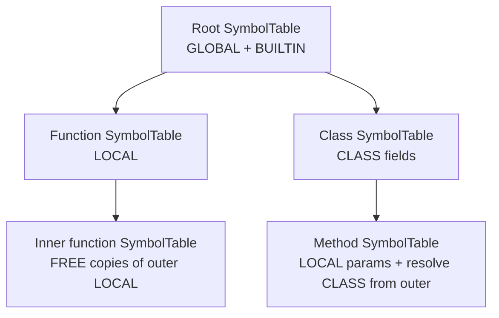
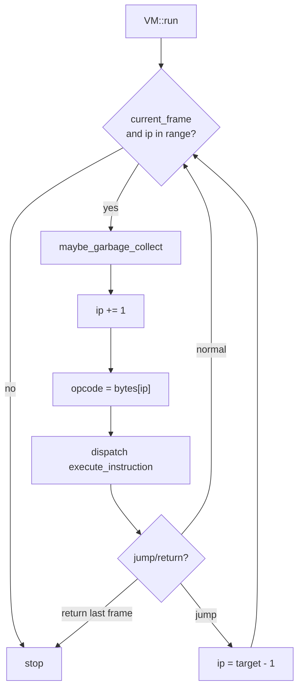
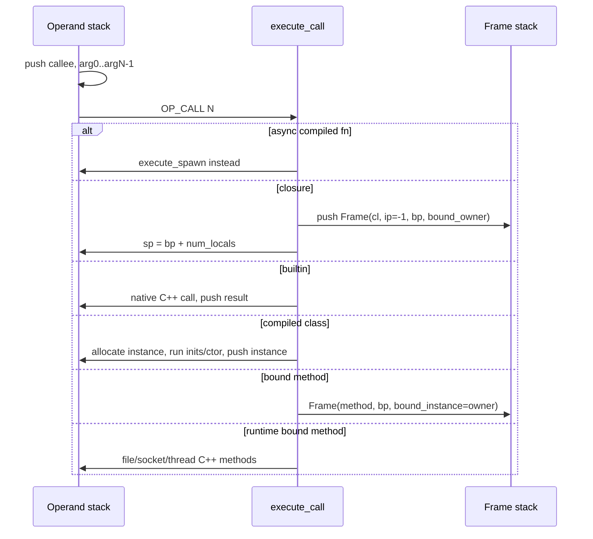
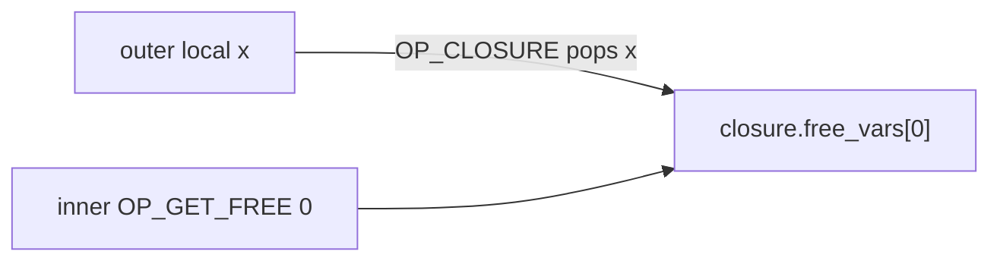
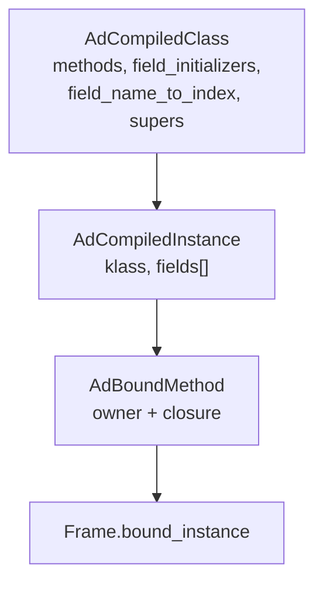
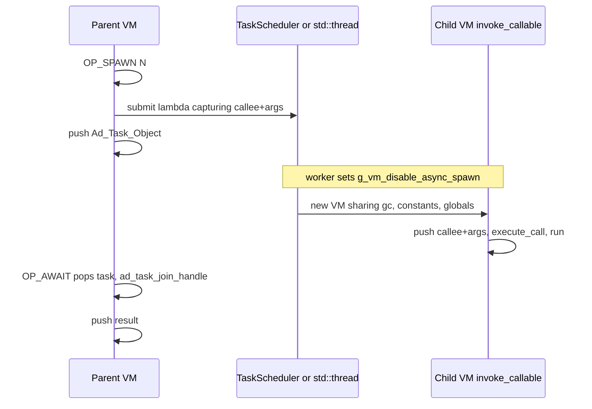

# Ad VM: how `-vm` executes code

This document describes the bytecode pipeline used when the interpreter is started with `-vm`. It is written against the C++ implementation in `vm/` (`compiler.cpp`, `vm.cpp`, `opcode.h`, `code.cpp`, `objects.h`). The tree-walking evaluator (`Evaluator`) is a separate engine; `-vm` does **not** call `Eval` for user statements except where builtins or `__thread` workers construct an evaluator environment.

Source of truth for opcode bytes and operand widths: `vm/opcode.h`, `vm/code.cpp`. Source of truth for runtime behavior: `VM::execute_instruction` in `vm/vm.cpp`.

---

## Table of contents

1. [End-to-end pipeline (`-vm`)](#1-end-to-end-pipeline--vm)
2. [Compiler, bytecode, and VM](#2-compiler-bytecode-and-vm)
   - [Symbol scopes](#21-symbol-scopes-symbolscope)
3. [Core runtime notions](#3-core-runtime-notions)
4. [Instruction encoding](#4-instruction-encoding)
5. [The fetch–decode–execute loop](#5-the-fetchdecodeexecute-loop)
6. [Jumps and control flow](#6-jumps-and-control-flow)
7. [Calls, frames, and returns](#7-calls-frames-and-returns)
8. [Closures and free variables](#8-closures-and-free-variables)
9. [Classes, instances, and methods](#9-classes-instances-and-methods)
10. [Persistence of data](#10-persistence-of-data)
11. [Opcode catalog](#11-opcode-catalog)
12. [Opcode details (VM handling)](#12-opcode-details-vm-handling)
13. [Threading](#13-threading)
14. [Sockets](#14-sockets)
15. [Reserved / unused opcodes](#15-reserved--unused-opcodes)
16. [Flags and limits](#16-flags-and-limits)

---

## 1. End-to-end pipeline (`-vm`)

`main.cpp` parses argv. `-vm` selects the VM path. Remaining arguments that are not flags are source files. `--no-mid-gc` / `-no-mid-gc` only turns off **mid-run** mark/sweep; end-of-run `forceFreeObjects()` still runs.



### File mode (`./main -vm path.ad`)

`Repl::ExecuteFileVM`:

1. Read the entire file into a string.
2. `compiler.reset()` — empty instruction buffer, new symbol table, builtins registered.
3. `load_bootstrap_vm(compiler, program, parser)` — for each path in `bootstrap_files` (`bootstrap.cpp`): read `.ad`, parse, `compiler.compile(&program)`. All of this **appends** to the same compiler instruction stream and constant pool.
4. Parse the user file, `compiler.compile(&program)`.
5. `Bytecode bytecode = compiler.getBytecode()` — copies `code.instructions`, `constants`, `global_names`, `bootstrap_global_names`.
6. `vm.load(bytecode)` — copies constants/globals metadata, wraps **all** instructions in a top-level closure, pushes frame 0 with `ip = -1`.
7. `ad_set_current_vm(&vm)` so builtins that need the live VM can find it.
8. `vm.run()` (optional `AD_VM_MAX_INSTRUCTIONS` cap).
9. Join leftover `threadPool` workers if any, then `garbageCollector->forceFreeObjects()`.

### REPL mode (`./main -vm`)

`LoopVM` does **not** compile bootstrap until a line is entered. Each `ExecuteLineVM`:

- `compiler.reset()` + `load_bootstrap_vm` **again** (full recompile of bootstrap every line).
- Parse/compile the line, print AST and disassembly, `vm.load` + `vm.run`, then `forceFreeObjects()`.

There is no persistent VM heap across REPL lines.

### What “execute” means

The VM never walks the AST at runtime. The compiler walked the AST once and emitted a byte stream. Runtime is: increment instruction pointer, read one opcode, mutate the operand stack / frames / globals.

---

## 2. Compiler, bytecode, and VM



### Compiler responsibilities

- Maintain a **symbol table** whose entries have a `SymbolScope` (see [§2.1](#21-symbol-scopes-symbolscope)).
- `emit(opcode, n, args)` → `Code::make` encodes bytes → append to `code.instructions`.
- Nested functions/methods: `enter_scope` / `leave_scope`. Inner instruction buffers become `AdCompiledFunction` objects stored in the **constant pool**; the enclosing code emits `OP_CLOSURE`.
- Classes: `compile_class_statement` builds an `AdCompiledClass` **at compile time**, stores it as a constant, `OP_SET_GLOBAL` into the class name. Methods are compiled to closures hanging off `klass->methods`, not typically via runtime `OP_CLASS` / `OP_SET_METHOD` (those opcodes exist on the VM but are not currently emitted).

### 2.1 Symbol scopes (`SymbolScope`)

Compile-time names are `Symbol` records in a nest of `SymbolTable`s (`vm/symbol_table.h`). Each symbol has:

- `name` — identifier text (`a`, `len`, `this`, …)
- `scope` — where the binding lives (the enum below)
- `index` — slot in that store (global slot, local slot, builtin index, free-var index, or instance field slot)
- `class_index` — extra index used with some `CLASS` symbols (`this`)

Tables are chained: the root table (`outer == nullptr`) is the **program / bootstrap global** table. `enter_scope()` for a function or method pushes a table with `outer` pointing at the previous one. `enter_scope_class()` is the class body table (fields). Builtins are registered on the root with `define_builtin` at compiler construction / `reset`.

`define(name)` on the **root** table creates `GLOBAL`. `define(name)` on an enclosed table creates `LOCAL`, unless `is_class_scope` is true, which creates `CLASS`. Re-`define` of an existing name in the same table **reuses** that symbol (so `i = 5; i = i + 1` keeps one local/global index).

`resolve(name)` walks `store` then `outer`. If the name is found in an outer table as `GLOBAL`, `BUILTIN`, or `CLASS`, the inner table uses that symbol as-is. If it is found as a **`LOCAL` of an enclosing function**, the inner table **does not** share that stack slot: it calls `define_free` and the inner name becomes `FREE`. That is how closures capture outer locals.

`load_symbol` maps scope → opcode:

| Scope | Typical definition | `index` means | Load opcode | Store opcode |
|---|---|---|---|---|
| `GLOBAL` | top-level / bootstrap `a = …`, class names | `globals[i]` / `OP_*_GLOBAL` operand | `OP_GET_GLOBAL` | `OP_SET_GLOBAL` |
| `LOCAL` | function/method params and locals | `stack[base_pointer + i]` | `OP_GET_LOCAL` | `OP_SET_LOCAL` |
| `BUILTIN` | `vm_register_builtin_symbols` (`len`, `println`, `__thread`, …) | builtin table index | `OP_GET_BUILTIN` | (not assignable) |
| `FREE` | inner function referring to an outer **local** | `frame->cl->free_vars[i]` | `OP_GET_FREE` | **not supported** (compiler error) |
| `FUNCTION` | named function literal (`let f = fn() { f() }`) | unused (`0`); identity is “current closure” | `OP_CURRENT_CLOSURE` | — |
| `CLASS` | instance fields (`L = []` in a class body), `this` | field slot in `AdCompiledInstance::fields` | `OP_CONSTANT` name + `OP_GET_PROPERTY_SYM` | `OP_PATCH_PROPERTY_SYM` |

#### `GLOBAL`

A binding on the **outermost** symbol table. Runtime storage is `VM::globals[index]`, parallel to `global_names[index]` for diagnostics and `__locals()`. Bootstrap identifiers (`_AdAlgos_MergeSort`, …) are globals too: they are compiled into the same table before user code. `load()` clears `globals`; the main chunk re-runs `OP_SET_GLOBAL` as it executes.

Globals are **shared across nested functions** by index: resolving a global from inside a function does **not** create a `FREE` symbol (`resolve` returns the global unchanged). Spawned worker VMs share the same `globals` vector of pointers.

#### `LOCAL`

A binding on a **non-root** table that is not a class-field define. That is function parameters (defined first, so they occupy the lowest local indexes) and variables assigned in that function body.

Runtime: the active `Frame::base_pointer` plus `index`. Locals die when the frame returns (`sp` is rewound). Two different calls of the same function have different `base_pointer`s, so they do not share locals.

If an **inner** function reads an outer local, that name is **not** `LOCAL` in the inner table; see `FREE`.

#### `BUILTIN`

Installed once on the root table (`define_builtin(index, name)`). `index` is the C++ builtin ordinal (`OP_GET_BUILTIN` operand), not a global slot. Assigning to a builtin is a compiler error. Builtins are not heap-allocated Ad values in the constant pool; the VM looks them up in the builtin map.

#### `FREE`

Created only by `resolve` when an inner function/method refers to a name that is a `LOCAL` (or other non-global/non-builtin/non-class) in an enclosing table. `define_free` appends the **original** symbol to `free_symbols` and gives the inner name a new index: position in `free_symbols` (0, 1, …).

At the **end** of compiling the inner function, the compiler emits loads of those original symbols in the **enclosing** chunk, then `OP_CLOSURE constIndex numFree`. The VM pops those values into `AdClosureObject::free_vars`. Later `OP_GET_FREE i` reads that array. The captured objects stay alive as long as the closure does.

Assignment through a free name is not implemented (`OP_SET_FREE` does not exist).

#### `FUNCTION`

Created by `define_function_name` when a function literal has a name (parser sets this for `let foo = fn() { … }` so the body can recurse). There is no stack slot. Loading the name emits `OP_CURRENT_CLOSURE`, i.e. “the closure object of the frame that is running right now.” That is how `foo()` inside `foo` calls the same closure without looking up a global that may not be assigned yet.

Index is always 0; the scope tag is what matters.

#### `CLASS`

Created by `define(name, true)` while compiling a class body (fields such as `L = []`) or by `define_this` / `define_class_name` for `this`. `index` is the **instance field slot**, stored on `AdCompiledClass::field_name_to_index` and used as the u16 operand of `OP_GET_PROPERTY_SYM` / `OP_PATCH_PROPERTY_SYM`.

Unlike `LOCAL`, a `CLASS` symbol found in an outer (class) table is **not** rewritten to `FREE` when a method body resolves it. Methods share the instance’s `fields[]` through `Frame::bound_instance`, not through closure capture.

Bare `L` in a method therefore compiles to “get/set property slot of `this`”, not “local on the method frame.” That is why `L = list(len(a), 0)` in `sort` updates the instance buffer that `merge` also sees.



Example:

```ad
n = 1                    // GLOBAL index 0
def outer(x) {           // LOCAL x index 0 in outer
  def inner() {
    return x + n         // x → FREE 0 (captures outer local)
                         // n → GLOBAL 0 (not captured)
  }
  return inner
}
```

Example (class):

```ad
class Box {
  L = []                 // CLASS slot 0 on the class table
  def sort(a) {          // LOCAL a; L resolves as CLASS
    L = list(len(a), 0)  // OP_PATCH_PROPERTY_SYM 0
  }
}
```

### Bytecode object

```text
Bytecode
  instructions   // flat unsigned char stream for the *main* (top-level) chunk
  constants[]    // ints, strings, compiled functions, compiled classes, …
  global_names[] // slot index → identifier (for errors and __locals)
  bootstrap_global_names  // names defined during bootstrap compile
```

Function bodies are **not** inlined into the main stream. They live as `AdCompiledFunction` in `constants`. The main stream only has `OP_CLOSURE constIndex freeCount` to reify them.

### VM responsibilities

- Hold a copy of constants and a `globals` vector.
- Execute the main chunk (and nested frames) as a stack machine.
- Allocate heap objects through `GarbageCollector::addObject`.
- Dispatch calls: closures, builtins, compiled classes (construct), bound methods, runtime bound methods (file/socket/thread).

---

## 3. Core runtime notions

### Operand stack

`VM::stack` is a fixed array of 2048 `Ad_Object*`. `sp` is the **next free slot** (size of the live stack).

- `push(obj)`: `stack[sp] = obj; sp++`
- `pop()`: `sp--; return stack[sp]` (the pointer at the old top remains in the array but is not live)

Almost every opcode is defined by how many values it pops and what it pushes. There is no separate “register file” except:

- **Globals** — `globals[i]`
- **Locals** — slots on the **same** stack, at `frame.base_pointer + local_index`
- **Free vars** — on the current frame’s closure: `frame->cl->free_vars[i]`
- **Instance fields** — `AdCompiledInstance::fields[i]`

### Frames

```text
Frame {
  AdClosureObject* cl      // code + free_vars + optional bound_owner
  int ip                   // instruction pointer into cl->fn->instructions
  int base_pointer         // stack index of local 0 (also first argument)
  AdCompiledInstance* bound_instance  // `this` for class methods
}
```

`frames` is a vector; `frames_index` is the count of live frames. `current_frame()` is `frames[frames_index - 1]`.

Frame 0 is the **main chunk** created in `VM::load` (synthetic closure around the whole program, `base_pointer = 0`, `ip = -1`).

### Instruction pointer (`ip`)

`ip` is an index into `Instructions::bytes`. It is **pre-incremented**:

1. `VM::load` sets `ip = -1`.
2. Each `execute_instruction` does `frame->ip += 1`, then reads `bytes[ip]` as the opcode.
3. Multi-byte operands advance `ip` further (`+= 1` or `+= 2`).
4. Jumps assign `frame->ip = target - 1` so the next pre-increment lands on `target`.

The run loop stops when `ip >= instructions.size - 1` (last byte is not a valid start of a new instruction in this convention) or when a return pops the last frame.

### Locals vs arguments

On `call_closure` / `call_bound_method`:

```text
stack:  ... | callee | arg0 | arg1 | ... | argN-1 | (scratch)
              ^ callee_index
                        ^ base_pointer = sp - num_args
```

After the call:

- A new frame is pushed with `ip = -1`, `base_pointer = sp - num_args`.
- `sp` is raised to `base_pointer + max(num_locals, 1)` so extra local slots exist above the arguments (uninitialized / leftover pointers until `OP_SET_LOCAL`).

`OP_GET_LOCAL i` / `OP_SET_LOCAL i` use `stack[base_pointer + i]`. Parameter 0 is local 0.

The callee pointer itself sits at `base_pointer - 1`. `OP_RETURN` / `OP_RETURN_VALUE` set `sp = base_pointer - 1` and then push the result, overwriting the callee slot.

### Instructions object

`Instructions` is `{ vector<unsigned char> bytes; int size; }`. Nested functions have their own `AdCompiledFunction::instructions`. Switching frames switches which byte stream `ip` indexes.

---

## 4. Instruction encoding

Each instruction is:

```text
[ opcode: 1 byte ] [ operand 0 … ] [ operand 1 … ]
```

Operand widths are in `Code::Code()` (`vm/code.cpp`). Width 2 is **big-endian** uint16 (`high << 8 | low`). Width 1 is uint8.

| Opcode | Operands (widths) | Meaning of operands |
|---|---|---|
| `OP_CONSTANT` | u16 | constant pool index |
| `OP_JUMP`, `OP_JUMP_NOT_TRUTHY` | u16 | absolute byte offset in **this** instruction stream |
| `OP_GET_GLOBAL`, `OP_SET_GLOBAL` | u16 | global slot |
| `OP_ARRAY`, `OP_HASH` | u16 | number of stack elements to consume |
| `OP_CALL`, `OP_SPAWN` | u8 | argument count |
| `OP_CALL_KW` | u8, u8 | positional count, keyword count |
| `OP_GET_LOCAL`, `OP_SET_LOCAL` | u8 | local slot |
| `OP_GET_BUILTIN` | u8 | builtin table index |
| `OP_CLOSURE` | u16, u8 | constant index of `AdCompiledFunction`, number of free vars to pop |
| `OP_GET_FREE` | u8 | free-var index on current closure |
| `OP_GET_PROPERTY_SYM`, `OP_PATCH_PROPERTY_SYM`, `OP_SET_PROPERTY_SYM` | u16 | field slot (`65535` = dynamic / name on stack) |
| `OP_INVOKE` | u8 | (defined; **not handled** in `execute_instruction`) |
| All others listed with `size 0` | — | stack only |

`Code::make` is the encoder; `read_uint16` / `read_uint8` are the decoder.

Example: `OP_CONSTANT` index 7 is three bytes: `00 00 07` if `OP_CONSTANT == 0`.

---

## 5. The fetch–decode–execute loop



`run_until_frames_index(n)` is the same loop but stops when `frames_index <= n`. Used for nested work that must finish before the caller continues: constructors, field initializers, default-argument thunks.

`maybe_garbage_collect` (if `vmMidRunCollection`) counts instructions and every `maxCycleVM` (default 10000) runs `markObjectsVM` + `sweepObjectsVM`. Roots: operand stack, frames (closures, bound instances), globals, constants, `ad_current_vm()` if different, plus evaluator environments if present.

---

## 6. Jumps and control flow

Both jump opcodes take an **absolute offset** into the current function’s `instructions.bytes`.

### `OP_JUMP` (unconditional)

```text
frame->ip = pos - 1;
```

Used for `else` skip, loop back-edges, `break` / `continue` (compiler emits placeholder `9999` then patches).

### `OP_JUMP_NOT_TRUTHY` (conditional)

```text
frame->ip += 2;           // skip the u16 operand
condition = pop();
if (!is_truthy(condition))
    frame->ip = pos - 1;
```

`is_truthy`: `NULL`/null object false; bool uses its value; everything else true (including `0`). This matches typical Monkey-style VMs, not C “nonzero int”.

### How the compiler builds `if` / `while`

Typical `if (c) { A } else { B }`:

```text
  <compile c>
  JUMP_NOT_TRUTHY  L_else
  <compile A>
  JUMP             L_end
L_else:
  <compile B>
L_end:
```

Typical `while (c) { body }`:

```text
L_cond:
  <compile c>
  JUMP_NOT_TRUTHY  L_end
  <compile body>
  JUMP             L_cond
L_end:
```

`for` loops additionally use the loop-stack to patch `break`/`continue` to the increment or exit.

Jumps never switch frames. They only move `ip` inside the current closure’s bytecode.

---

## 7. Calls, frames, and returns



Stack layout at `OP_CALL N`:

```text
high sp -->  argN-1
             ...
             arg0
             callee
low
```

### Returns

- `OP_RETURN_VALUE`: pop result, pop frame, `sp = old_base_pointer - 1`, push result.
- `OP_RETURN`: pop frame, `sp = old_base_pointer - 1`, push `nullptr` (void).

Returning from frame 0 (`frames_index == 1` before pop) with `OP_RETURN_VALUE` prints `WARNING: return outside function` when `warn_return_outside_function` is true (default for main programs; import runners set it false).

If `frames_index` becomes 0, `execute_instruction` returns false and `run` stops.

### Keyword calls (`OP_CALL_KW`)

Compiler emits value/name pairs then `OP_CALL_KW num_pos num_kw`. The VM pops `num_kw` `(value, name)` pairs into a map, fills a positional vector from the function’s `parameter_names` and defaults, then forwards to `execute_call` or `call_class`.

---

## 8. Closures and free variables

When compiling `fn(...) { ... }` or `def` that references outer locals:

1. Inner scope records unresolved names as `FREE` via `define_free`.
2. After compiling the body, the compiler **loads each free symbol in the enclosing function** (so they sit on the stack), then emits:

```text
OP_CLOSURE  <constIndex of AdCompiledFunction>  <numFree>
```

3. VM pops `numFree` values (reverse order) into `closure->free_vars`, attaches `fn` from the constant pool (`owns_fn = false` — the function object stays in constants), pushes the closure.

At runtime, `OP_GET_FREE i` pushes `frame->cl->free_vars[i]`. Assignment to free vars is **not implemented** (compiler error).

Recursive named functions (`let f = fn() { f() }`): compiler `define_function_name`; `OP_CURRENT_CLOSURE` pushes the running frame’s closure so the body can call itself.



---

## 9. Classes, instances, and methods

### Compile time

`compile_class_statement`:

1. Enter a **class** compilation scope.
2. For each field `L = …`, define a `CLASS` symbol (slot index) and compile a **field initializer** function (`compile_class_field_initializer`) that evaluates the RHS and `OP_PATCH_PROPERTY_SYM`.
3. For each `def`, `compile_class_method` → `AdClosureObject` in `klass->methods[name]`. `is_class_method = true`. `async def` sets `is_async`.
4. Inheritance: `merge_parent_class` copies parent methods/fields/`super_classes_by_name`.
5. Emit the `AdCompiledClass` as a constant and `OP_SET_GLOBAL` under the class name.

The live compiler path does **not** emit `OP_CLASS` / `OP_SET_METHOD` / `OP_INSTANTIATE`. Instantiation is `OP_CALL` on a class object.

### Runtime: constructing `Foo(args…)`

`execute_call` sees `OBJ_COMPILED_CLASS` → `call_class`:

1. Snapshot stack below the callee (so nested `run_until_frames_index` cannot smash caller slots).
2. `new AdCompiledInstance`; `instance->klass = cl`; GC-track it.
3. Run field initializers **parents first**, each as a bound method with 0 args (`call_bound_method` + `run_until_frames_index`).
4. If `constructor` exists, bind it to the instance, push ctor args, run to completion, discard ctor return.
5. Restore snapshot, push the instance.

### `this` and fields

- `OP_GET_THIS` pushes `frame->bound_instance` (or `cl->bound_owner`).
- Bare field read in a method: `OP_CONSTANT "name"` + `OP_GET_PROPERTY_SYM slot`.
- Bare field write: value then name then `OP_PATCH_PROPERTY_SYM slot`.
- `obj.field` outside: `OP_GET_PROPERTY` (owner + name on stack).
- `obj.field = v`: `OP_SET_PROPERTY`.

`65535` as the u16 slot means “look up by the string on the stack” (dynamic / late fields).

### Method calls

Compiler `emit_instance_method_call`:

```text
<compile owner>
OP_CONSTANT "methodName"
OP_GET_METHOD
<compile args>
OP_CALL N
```

`OP_GET_METHOD` for `OBJ_COMPILED_INSTANCE`: look up `klass->methods` (walk supers via `lookup_class_method`), wrap `AdBoundMethod(owner, closure)`. If the name is a field holding a closure, bind that instead (assigned callbacks). File/socket/thread owners become `AdRuntimeBoundMethod`.

`call_bound_method` pushes a frame with `bound_instance = bm->owner` so field ops and `this` work.

### `super(Parent).method(...)`

```text
OP_GET_THIS
OP_CONSTANT "Parent"
OP_CONSTANT "method"
OP_GET_SUPER_METHOD
<args>
OP_CALL N
```

Looks up `inst->klass->super_classes_by_name[Parent]->methods[method]`, binds to **this instance**.



---

## 10. Persistence of data

| Store | Lifetime | Notes |
|---|---|---|
| `constants` | Process / until next `vm.load` | Interned literals and compiled functions/classes. `load()` **replaces** the vector. |
| `globals` | Until next `load` or process end | `load()` does `globals.clear()`. Bootstrap names are compiled into the same stream, so they are re-initialized when the main chunk runs `OP_SET_GLOBAL`. |
| Operand stack | Until pop / frame return | Not a heap root except during GC mark of `stack[0..sp)`. |
| Locals | Until frame return | Same physical stack. |
| Closure `free_vars` | Until closure is collected | Captured objects stay reachable through the closure. |
| Instance `fields` | Until instance is collected | Including `this.L` style aux buffers. |
| `last_loaded_bytecode` | Until next load | Extra GC root for constants. |
| GC linked list | Until sweep / `forceFreeObjects` | `addObject` on allocation. |

**REPL / file teardown:** `forceFreeObjects()` unmarks everything and sweeps — no live Ad heap after the run.

**Import (`execute_import_source`):** compiles a nested unit, rebases constant indices, runs a **child VM** sharing `gc`, `constants`, and `globals`, then copies `runner.globals` back. That is how imported globals persist in the parent VM.

**Threads/tasks:** spawned work uses `invoke_callable` on a **fresh VM** that shares `gc`, `constants`, and `globals` pointers. Concurrent mutation of `globals` is possible; there is no VM-wide interpreter lock. `g_vm_disable_async_spawn` (thread-local) prevents nested `async` from spawning again inside the worker.

---

## 11. Opcode catalog

Quick reference. “Stack” is written bottom → top (top is rightmost).

| Byte enum | Name | In/out (conceptual) | VM handler |
|---|---|---|---|
| `OP_CONSTANT` | push constant | → c | `constants[idx]` |
| `OP_ADD` … `OP_MOD` | arithmetic | a b → r | `execute_binary_operation` |
| `OP_POP` | discard | x → | `pop()` |
| `OP_TRUE` / `OP_FALSE` | bool | → bool | interned TRUE/FALSE |
| `OP_EQUAL` … `OP_GREATERTHAN_EQUAL` | compare | a b → bool | `execute_comparison` |
| `OP_AND` / `OP_OR` | bool logic | a b → bool | require `OBJ_BOOL` |
| `OP_MINUS` | unary minus | x → r | `execute_minus_operator` |
| `OP_BANG` | unary not | x → bool | `execute_bang_operator` |
| `OP_JUMP` | goto | (none) | `ip = pos-1` |
| `OP_JUMP_NOT_TRUTHY` | cond goto | c → | jump if not truthy |
| `OP_NULL` | null | → null | `&NULLOBJECT` |
| `OP_GET_GLOBAL` / `OP_SET_GLOBAL` | globals | / x → | `globals[i]` |
| `OP_ARRAY` / `OP_HASH` | containers | e0..eN → obj | `build_array` / `build_hash` |
| `OP_INDEX` | read index | left i → v | list/hash/string |
| `OP_SET_INDEX` | write index | left i v → | in-place |
| `OP_POSTFIX_INDEX` | postfix `a[i]++` style | old new left i → old | set then push old |
| `OP_SLICE` | slice | left start end step → v | `execute_slice_expression` |
| `OP_PATCH_INDEX` | compound index assign | v left i → | set, no push |
| `OP_CALL` / `OP_CALL_KW` | call | callee args… → result | `execute_call` |
| `OP_RETURN_VALUE` / `OP_RETURN` | return | [v] → v / null | pop frame |
| `OP_GET_LOCAL` / `OP_SET_LOCAL` | locals | / x → | `stack[bp+i]` |
| `OP_GET_BUILTIN` | builtin | → builtin | `vm_get_builtin_object` |
| `OP_CLOSURE` | make closure | free… → cl | pop frees |
| `OP_GET_FREE` | captured | → v | `cl->free_vars[i]` |
| `OP_CURRENT_CLOSURE` | self | → cl | `frame->cl` |
| `OP_CLASS` | empty class | → klass | `new AdCompiledClass` (legacy emit) |
| `OP_SET_METHOD` | attach method | klass meth name → klass | `klass->methods[name]` |
| `OP_GET_PROPERTY` | `obj.f` | obj name → v\|bound | |
| `OP_SET_PROPERTY` | `obj.f=v` | obj v name → | |
| `OP_GET_METHOD` | method lookup | obj name → bound | |
| `OP_GET_PROPERTY_SYM` | field by slot | name → v | needs `bound_instance` |
| `OP_PATCH_PROPERTY_SYM` | set field by slot | v name → | |
| `OP_GET_THIS` | `this` | → inst | |
| `OP_GET_SUPER_METHOD` | super | inst parent meth → bound | |
| `OP_FILE_STMT_OUTPUT` | print stmt result | v → | `Inspect()` + newline |
| `OP_SPAWN` | spawn task | callee args… → task | `execute_spawn` |
| `OP_AWAIT` | join task | task → result | `execute_await` |

---

## 12. Opcode details (VM handling)

### 12.1 Constants and literals

**`OP_CONSTANT` (u16 idx)**  
`frame->ip += 2`. Push `constants[idx]` if in range. Used for numbers, strings, field-name strings, compiled functions, compiled classes.

**`OP_TRUE` / `OP_FALSE` / `OP_NULL`**  
Push interned boolean objects or `&NULLOBJECT` (`permanent`). Not heap-allocated each time.

### 12.2 Arithmetic and comparison

**`OP_ADD`, `OP_SUB`, `OP_MULTIPLY`, `OP_DIVIDE`, `OP_MOD`**  
Pop right, pop left. Integer and float paths allocate a **new** boxed object and `gc->addObject`. String `+` concatenates. List `+` concatenates elements. Unsupported types: error / null.

**`OP_MINUS`**  
Unary negation of int/float.

**`OP_BANG`**  
Push boolean not of `is_truthy`.

**`OP_EQUAL`, `OP_NOTEQUAL`, `OP_GREATERTHAN`, `OP_GREATERTHAN_EQUAL`**  
There is no `OP_LESSTHAN`; the compiler rewrites `<` by swapping operands and using `OP_GREATERTHAN`.

**`OP_AND` / `OP_OR`**  
Both operands must already be `OBJ_BOOL` (compiler emits bool-producing code). Not short-circuit at VM level; short-circuit is compiled with jumps if the language requires it at AST level for some forms — these opcodes themselves always pop both.

### 12.3 Stack hygiene and printing

**`OP_POP`**  
Discard expression results inside blocks.

**`OP_FILE_STMT_OUTPUT`**  
Pop; if not `OBJ_SIGNAL`, `std::cout << Inspect() << '\n'`. If `OBJ_ERROR`, stop the VM (`return false`). Compiler emits this only for **top-level** expression statements (`compiling_program_direct_statement`), matching evaluator REPL/file print behavior.

### 12.4 Globals and builtins

**`OP_SET_GLOBAL` (u16 i)**  
Pop value. Resize `globals` if needed. If value is `OBJ_ERROR`, print and halt. Store `globals[i] = value`.

**`OP_GET_GLOBAL` (u16 i)**  
Push `globals[i]` if set. If missing: in a class method, try instance field of the same name (so some unqualified names resolve as fields). Else push `Ad_Error_Object("variable X undefined.")`.

**`OP_GET_BUILTIN` (u8 i)**  
Push the C++ builtin object (`println`, `len`, `__iosocket`, `__thread`, `list`, …). Index space is shared with the compiler’s builtin symbol table (`vm_register_builtin_symbols`).

### 12.5 Locals

**`OP_SET_LOCAL` / `OP_GET_LOCAL` (u8 i)**  
`slot = base_pointer + i`. Bounds-checked against `stackSize`. Set pops into that slot; get pushes a copy of the pointer.

### 12.6 Aggregates and indexing

**`OP_ARRAY` (u16 n)**  
`build_array(sp-n, sp)` then `sp -= n`, push list. Elements are **moved** (pointers) into a new `Ad_List_Object`.

**`OP_HASH` (u16 n)**  
`n` is the number of stack slots (keys and values interleaved). Builds `Ad_Hash_Object`.

**`OP_INDEX`**  
Pop index, pop left. Lists/strings use integer index; hashes use key. Out-of-range list access depends on `vector[]` (can trap on hardened libc++).

**`OP_SET_INDEX`**  
Pop value, index, left. Mutates list/hash in place. No result pushed.

**`OP_PATCH_INDEX`**  
Same mutation for compound assignment (`a[i] += 1`): stack is `value, left, index`.

**`OP_POSTFIX_INDEX`**  
Stack: `old_value, new_value, left, index`. Writes `new_value`, pushes `old_value` (postfix `a[i]++`).

**`OP_SLICE`**  
Pop step, end, start, left. Null objects mean omitted bounds. `execute_slice_expression` builds a new list/string.

### 12.7 Closures and calls

See [§7](#7-calls-frames-and-returns) and [§8](#8-closures-and-free-variables). Async: if callee’s `AdCompiledFunction::is_async` and `g_vm_disable_async_spawn` is false, `OP_CALL` is redirected to `execute_spawn` (same stack shape as `OP_SPAWN`).

### 12.8 Class-related opcodes (handled)

**`OP_CLASS`**  
`new AdCompiledClass`, track, push. Intended for building a class at runtime; current compiler instead materializes `AdCompiledClass` in the constant pool.

**`OP_SET_METHOD`**  
Stack: `… klass, methodClosure, name`. Pops name and closure; **leaves klass on stack**. `klass->methods[name] = closure`.

**`OP_GET_PROPERTY` / `OP_SET_PROPERTY`**  
Runtime name + owner. Get may return a bound method if the name is a method. Set grows `fields` and updates `field_name_to_index`.

**`OP_GET_PROPERTY_SYM` / `OP_PATCH_PROPERTY_SYM`**  
Operate on `current_bound_instance()` (method `this`), not an owner on the stack. The u16 is the compile-time slot. `65535` uses the popped string as the field name.

**`OP_GET_METHOD`**  
See [§9](#9-classes-instances-and-methods). Critical for sockets/threads: non-instance objects become `AdRuntimeBoundMethod`.

**`OP_GET_THIS` / `OP_GET_SUPER_METHOD`**  
See [§9](#9-classes-instances-and-methods).

### 12.9 Spawn / await

See [§13](#13-threading).

---

## 13. Threading

There are **two** threading models in the VM.

### 13.1 Language `spawn` / `await` and `async def` (`OP_SPAWN`, `OP_AWAIT`)



`execute_spawn`:

- Same stack as `OP_CALL`.
- Prefer `ad_global_task_scheduler()->submit(...)`.
- Else detached `std::thread` + `std::promise` / `AdTaskHandle`.
- Worker: `invoke_callable` creates a **new** `VM` with `runner.gc = gc`, copies `constants`/`globals` **vectors** (same object pointers), runs the call to completion, returns the top-of-stack object.

`execute_await`: pop; must be `OBJ_TASK`; `ad_task_join_handle`; push result or error.

`async def` / `async fun`: compiler sets `is_async` on the compiled function. A normal `OP_CALL` then behaves like `OP_SPAWN`. Nested workers disable that redirection so the body runs synchronously.

### 13.2 `__thread` builtin objects (`OBJ_THREAD`)

Bootstrap / user code calls builtin `__thread(...)` (`thread_builtin` in `builtins.cpp`) to allocate `Ad_Thread_Object` (callback, params, internal `std::thread*`, optional `internal_gc`).

Method dispatch is **not** bytecode for the body of `runAsync`. Compiler emits `t.runAsync()` as `OP_GET_METHOD` + `OP_CALL`. VM `call_runtime_bound_method`:

| Method names | C++ |
|---|---|
| `callback`, `execute` | `thread_callback` |
| `runAsync`, `start` | `thread_async_run(receiver, gc, thread_env)` |
| `runBlocking`, `join` | `thread_blocking_run` |
| `await` | `thread_await`; push `thread_object->result` |

`thread_async_run` / workers (see `thread_workers.cpp`) may construct a VM (`vm.gc = gc`, copy parent via `ad_current_vm()`) and `invoke_callable` the callback — same nested-VM pattern as spawn.

`ExecuteFileVM` joins `threadPool` and `forceFreeObjects` on each worker’s `internal_gc` after `vm.run()`.

### 13.3 Persistence and races

Spawned tasks share heap objects and `globals` with the parent. Mid-run GC on the parent marks `ad_current_vm()` plus the running VM; workers are not a complete concurrent GC story. Prefer joining tasks before process teardown.

---

## 14. Sockets

Sockets are **heap objects** created by the `__iosocket` builtin (`Ad_Socket_Object`: host, port, flags, native fd state). User-facing types in bootstrap (`bootstrap/sock.ad`) wrap that builtin.

There are **no socket-specific opcodes**. Flow:

```text
__iosocket(...)     → OP_GET_BUILTIN + OP_CALL  → OBJ_SOCKET
sock.create_server() → OP_GET_METHOD + OP_CALL
```

`OP_GET_METHOD` on `OBJ_SOCKET` pushes `AdRuntimeBoundMethod(socket, "create_server")`.

`call_runtime_bound_method` (`vm.cpp`) maps names to `socket_utils.cpp`:

| Method | C++ |
|---|---|
| `create_server` | `create_server` |
| `create_client` | `create_client2` |
| `accept` | `accept_socket` (result GC-tracked) |
| `send` | `send_socket(receiver, args[0])` |
| `read` | `read_socket` |
| `readHTTP` | `readHTTP` |
| `sendAndReadBackHTTP` | `sendAndReadBackHTTP` |
| `sendAndReadBackHTTPS` | `sendAndReadBackHTTPS` |
| `close` | `close_socket` |
| other | print unknown method, null |

These calls **block** the OS thread running that VM (the main `vm.run` loop or a spawn worker). There is no opcode-level park/resume for sockets.

Files work the same way (`OBJ_FILE` + `read`/`write` in `call_runtime_bound_method`).


---

## 15. Reserved / unused opcodes

These exist in `OpCodeType` / `Code` definitions but are **not** dispatched in `execute_instruction` (unknown opcode error if they ever appear in a stream):

| Opcode | Notes |
|---|---|
| `OP_INSTANTIATE` | Construction is `OP_CALL` on `AdCompiledClass`. |
| `OP_INVOKE` | Method calls are `OP_GET_METHOD` + `OP_CALL`, not a fused invoke. |
| `OP_SET_PROPERTY_SYM` | Compiler emits `OP_PATCH_PROPERTY_SYM` for field writes. |

`OP_CLASS` and `OP_SET_METHOD` **are** implemented on the VM but the current compiler builds `AdCompiledClass` at compile time and stores it in constants.

---

## 16. Flags and limits

| Mechanism | Effect |
|---|---|
| `-vm` | Compile + `VM::run` instead of `Evaluator::Eval`. |
| `-no-mid-gc` / `AD_VM_MID_RUN_GC=0` | Skip periodic `markObjectsVM`/`sweepObjectsVM`. |
| `AD_VM_GC_INTERVAL` | Instructions between mid-run collections (`maxCycleVM`). |
| `AD_VM_MAX_INSTRUCTIONS` | Hard stop in `run` / `run_until_frames_index`. |
| `ADLANG_QUANTUM_BUDGET` | Task scheduler quantum (spawn pool), not bytecode `ip`. |
| Stack size | 2048 slots (`VM::stackSize`). Overflow prints and skips push. |
| Jump / constant indices | u16 (0…65535). |

---

## Appendix A — worked micro example

Source:

```ad
a = 1 + 2
```

Compiler (top-level, simplified):

```text
0000 OpConstant 0        ; 1
0003 OpConstant 1        ; 2
0006 OpAdd
0007 OpSetGlobal 0       ; a
```

(`1` and `2` are distinct constant-pool ints.)

VM:

1. Frame 0, `ip` starts at -1.
2. `OP_CONSTANT` push `1`; `OP_CONSTANT` push `2`.
3. `OP_ADD` pop 2 and 1, push `3` (new `Ad_Integer_Object`).
4. `OP_SET_GLOBAL 0` pop `3` into `globals[0]`.
5. Stream ends; `run` exits.

If the same line were a bare expression `1 + 2` at file top level, `OP_FILE_STMT_OUTPUT` would print `3`.

---

## Appendix B — key files

| File | Role |
|---|---|
| `main.cpp` | `-vm` dispatch |
| `repl.cpp` | `ExecuteFileVM`, `ExecuteLineVM`, `load_bootstrap_vm` |
| `bootstrap.cpp` | Bootstrap file list and VM compile loop |
| `vm/compiler.cpp` | AST → opcodes |
| `vm/code.cpp` | Encoding, disassembly, widths |
| `vm/opcode.h` | Opcode enum |
| `vm/vm.cpp` | `load`, `run`, `execute_instruction`, calls, spawn, import |
| `vm/objects.h` | Compiled function/class/instance/bound method |
| `vm/frame.h` | Frame |
| `vm/symbol_table.h` | Scopes |
| `builtins.cpp` | `__iosocket`, `__thread`, `list`, … |
| `socket_utils.cpp` | Native socket ops |
| `thread_utils.cpp` / `thread_workers.cpp` | `__thread` workers |
| `gc.cpp` | `markObjectsVM` / `sweepObjectsVM` |
